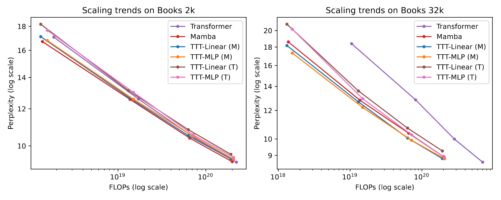

# Learning at Test Time

Recently, a new family of model called Test-time-training (TTT) emerges as a contender to the long standing transformer architecture in LLM [5]. The TTT models adaptively adjusts its hidden states through gradient updates. 

In this post, I document my notes about the idea of test-time-training.

## Test-Time-Training

The idea of test-time-training first appears in the literature in studies to address distribution shifts at test time, where test data come from a different distribution than the source data used to train the model. 

Specifically, given input source data $x^s,y^s\sim\mathcal{P_s}$ for training a base model $\theta$ and adaptation parameter $\phi$ with objective $\mathcal{L}(x^s,y^s;\theta)+\mathcal{L}(x^s;\phi)$ and target data $x^t\sim\mathcal{P}_t$ at test time with objective $\mathcal{L}(x^t;\phi)$, TTT aims to learn the model parameters $\theta$ for solving a main task and $\phi$ for efficient adaptation of mappings to latent distributions at test-time.

Concretely, work by [1] proposes to learn a feature extraction model capable of aligning latent distributions at test time through a gradient update with self-supervised objective. Specifically, the training problem is

$$
{\tilde{\theta_e},\tilde{\theta_m},\tilde{\theta_s}}\leftarrow\argmin_{\theta_e,\theta_m,\theta_s}\mathcal{L}(x^s,y^s;\theta_m,\theta_e)+\mathcal{L}(x^s;\theta_s,\theta_e),
$$

where $\theta_m$ is the model for the main supervised task; $\theta_e$ is the feature extractor; $\theta_s$ is the self-supervised task model.

At test-time, only the feature extractor is updated by minimizing the self-supervised task loss over the feature extractor model, i.e.

$$
\hat{\theta}_e\leftarrow\argmin_{\theta_{e}^{'}}\mathcal{L}(x^t;\tilde{\theta_s},\theta^{'}_e),
$$

where $\theta_e^{'}$ is initialized with $\tilde{\theta}_e$. The final prediction is obtained by the optimized $\tilde{\theta_m}$ main task model and the updated feature extractor $\hat{\theta}_e$. 

There are a couple of choices for the self-supervised task.
- Prediction of rotated images by [1] is chosen for improving image classification task [1]; policy adaptation to perturbed environment [8].
- Denoising masked images as in Mask Autoencoder by [2] is proposed to further improve the prediction accuracy of corrupted images
- Denoising pseudo labels as in contrastive learning is proposed by [13] to update the feature extractor.
- Denoising latents as in denoising auto-encoder by [5] tasks the learning of a model that keeps necessary latent information for sequence modelling.

The choice of denoising objective for self-supervised task seems to emerge as a more preferable choice. I hypothesize that such preference is due to that denoising objective is a more compute efficient (as measured by FLOPs/parameter) formulation than the others. It is similar to the trend in language modelling where the span prediction task in BERT is less used and next-token prediction task is dominant.

Other than [1], several test-time-training frameworks have been proposed 
- [12] proposes Adaptive Risk Minimization where meta-parameters are learnt to adapt task parameters at test time either through contextual parameters or through gradient based meta-learning.
- Dynamic evaluation [9, 17] can be view as treating subsequent elements in a sequence as new test data to which a model adapts. It adapts models to recent sequence history via gradient descent to exploit patterns in sequence. [6] extends the learning of adaptable weights at test time to train time with MAML and trains a bilevel model.

## Test-time-training in Sequence Modelling

So the idea of TTT in sequence modelling for language had a long history since the work by [9, 17, 6]. However, previous work focus on applying TTT to the model parameters and not until recently by [5] that apply TTT to a model as hidden state, did a scalable language model competitive to decoder-only transformer (GPT) emerge. 

Below I summarize my notes in reading [5] and use TTT model synonomously to the TTT-Linear presented in [5].

Sequence modelling can be viewed as storing history content into the hidden state. A summary is as follows (see the figure taken from [5] below). The hidden state of Naive RNN can be represented as an activation vector, updated by model parameters; that of self-attention is a list of uncompressed vectors of past keys and values; that of a Naive TTT is formulated as parameters of linear model, where updates to the model is via gradient decent over a self-supervised loss. [5] shows that the naive TTT case is equivalent to linear attention [29].

From this point of view, TTT-Linear is a permuted view of the attention where instead of compressing and selecting the relevant information of history tokens via attention update, it keeps the relevant information via learning a model over the history tokens. The hidden state model would then remember input token that produce large gradients, i.e. inputs that makes the model learns a lot. Note that, computationally, the model is much efficient at the inference time as tokens are not cached for attention updates and in principle can be scaled more easily to sequence length in millions.

The optimization of the TTT-Linear is bilevel, consisting of an inner loop and outer loop. The inner loop is the update to the hidden state model sequentially via gradient descent to a denoising autoencoding loss. The outer loop is the update to the rest of the model parameters to a next-token prediction loss. Unlike work in dynamic evaluation [6] where the bilevel optimization involves second order optimization, the optimization of innder loop and outer loop of TTT-Linear is decoupled. The inneer loop of TTT-Linear can be viewed as a layer of the neural model for language modelling.

The author scales the model to 1.3B parameters and shows that it outperforms transformer when one trains the model with seqnece length at 32k (See Figure below. Taken from Figure 12 of [5]). 

However, given the right figure above, I hypothesize that as training FLOPs increases to 1E22 ~ 1E23, the TTT models and transformers may perform similarily.

## Possible research questions

Personally, I think the breakthrough builds upon two innovations: equivalence of TTT with a linear model and batch gradient descent to linear attention [29]; decoupling the gradient updates to the fast model (TTT layer) and slow model (rest of LM). I surmise that the following research direction may be worth pursing in light of the idea of TTT
- Can we extend LLM decoding head for multi-token prediction through TTT or dynamic evaluation? 
- Can we convert a pre-trained transformer to TTT-Linear for speeding up LLM inference?
- Can we formulate the layer forward process in transformer with TTT such that at inference time we do not have to walk through every layer of the transformer?
- How much memory of the hidden state model can store? Can we extract the stored memory for an update to the slow model in return?

## Reference
[1] Test-Time Training with Self-Supervision for Generalization under Distribution Shifts, 2020 \
[2] Test-Time Training with Masked Autoencoders, 2022 \
[3] Test-Time Training on Video Streams, 2023 \
[4] Learning to (Learn at Test Time), 2024 \
[5] Learning to (Learn at Test Time): RNNs with Expressive Hidden State, 2024 \
[6] Meta-Learning Fast Weight Language Models, 2022 \
[7] Self-Supervised Test-Time Learning for Reading Comprehension, 2021 \
[8] Self-Supervised Policy Adaptation during Deploymedelnt, 2021 \
[9] Dynamic Evaluation of Neural Sequence Model, 2017 \
[10] Test-time prompt tuning for zero-shot generalization in vision-language models, 2022 \
[11] Align Your Prompts: Test-Time Prompting with Distribution Alignment for Zero-Shot Generalization, 2023 \
[12] Adaptive Risk Minimization: Learning to Adapt to Domain Shift, 2021 \
[13] Contrastive Test-Time Adaptation, 2023 \
[14] Back to the Source: Diffusion-Driven Adaptation to Test-Time Corruption, 2024 \
[15] Fast Model Editing at Scale, 2022 \
[16] TENT: Fully Test-Time Adaptation by Entropy Minimization, 2021 \
[17] Dynamic Evaluation of Transformer Language Models, 2019 \
[19] Transformers are rnns: Fast autoregressive transformers with linear attention, 2020 \
[20] LLM.int8(): 8-bit Matrix Multiplication for Transformers at Scale, 2022