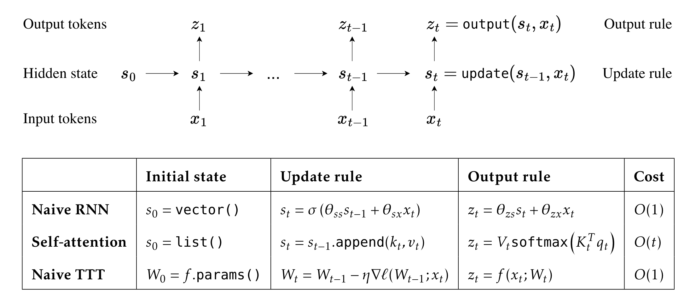
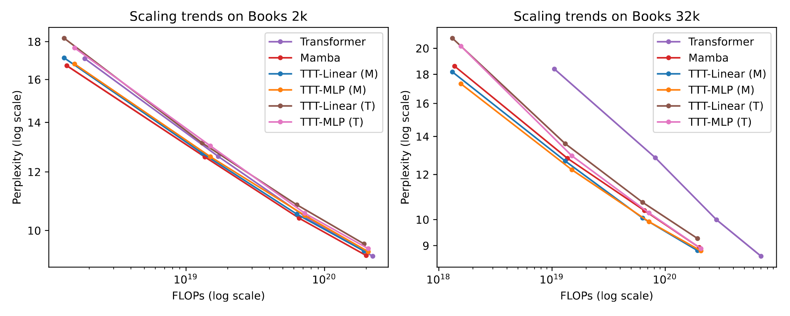

# Learning at Test Time

Recently, a new class of models known as Test-Time Training (TTT) has emerged as a viable alternative to the longstanding transformer architecture in large language models (LLMs) [4,5]. TTT models dynamically adjust their hidden states through gradient updates, offering a novel approach to enhancing model performance and adaptability.

In this post, I document my notes about the idea of test-time-training.

## Test-Time-Training

The concept of test-time training first emerged in the literature as a methodology to address distributional shifts occurring at test time, where the test data originate from a distribution that differs from the source data used during model training.

Specifically, given input source data $x^s,y^s\sim\mathcal{P_s}$ used for training a base model $\theta$ and adaptation parameter $\phi$, with objective $\mathcal{L}(x^s,y^s;\theta)+\mathcal{L}(x^s;\phi)$, and target data $x^t\sim\mathcal{P}_t$ encountered at test time with objective $\mathcal{L}(x^t;\phi)$, TTT aims to learn the model parameters $\theta$ for solving a main task and $\phi$ for efficient adaptation of mappings to latent distributions at test-time.

Specifically, the work by [1] proposes the learning of a feature extraction model designed to align latent distributions at test time using a gradient-based update informed by a self-supervised objective. In particular, the training problem is formulated as follows:

$$
{\tilde{\theta_e},\tilde{\theta_m},\tilde{\theta_s}}\leftarrow \arg\min_{\theta_e,\theta_m,\theta_s}\mathcal{L}(x^s,y^s;\theta_m,\theta_e)+\mathcal{L}(x^s;\theta_s,\theta_e),
$$

where $\theta_m$ is the model for the main supervised task; $\theta_e$ is the feature extractor; $\theta_s$ is the self-supervised task model.

At test-time, only the feature extractor is updated by minimizing the loss associated with the self-supervised task over the feature extraction model, specifically:

$$
\hat{\theta}_e\leftarrow\arg\min_{\theta_{e}^{'}}\mathcal{L}(x^t;\tilde{\theta_s},\theta^{'}_e),
$$

where $\theta_e^{'}$ is initialized with $\tilde{\theta}_e$. The final prediction is obtained by the optimized $\tilde{\theta_m}$ main task model and the updated feature extractor $\hat{\theta}_e$. 

There are several options for the self-supervised task:
- The prediction of rotated images, as proposed by [1], is employed to enhance image classification performance.
- Policy adaptation to perturbed environments in RL, as described in [7], is another approach.
- Denoising masked images, as implemented in the Mask Autoencoder by [2,3], is suggested to further improve prediction accuracy for corrupted images.
- Denoising pseudo-labels, a method used in contrastive learning according to [11], is proposed for updating the feature extractor.
- Denoising latent variables, similar to the approach in denoising autoencoders described by [5], focuses on preserving essential latent information for sequence modeling.

The preference for the denoising objective in self-supervised tasks appears to be increasing. I hypothesize that this preference arises because the denoising objective is computationally more efficient, as measured by FLOPs per parameter, compared to alternative formulations. This trend is analogous to the field of language modeling, where the next-token prediction task has become dominant over the less frequently used span prediction task in models such as BERT.

In addition to the work presented in [1], several other test-time training frameworks have been proposed:
- Adaptive Risk Minimization, as described in [10], introduces a method where meta-parameters are learned to adapt task parameters at test time. This adaptation can be achieved either through contextual parameters or via gradient-based meta-learning.
- Dynamic Evaluation, discussed in [8,12], treats subsequent elements in a sequence as new test data to which the model must adapt. This approach involves adapting the model to recent sequence history through gradient descent to leverage patterns within the sequence. Furthermore, the work in [6] extends the concept of adaptable weights from test time to training time by employing MAML to train a bilevel model.

## Test-time-training in Sequence Modelling

The concept of test-time training (TTT) in sequence modeling for language has a long history, with foundational work by [8,12,6]. However, earlier research primarily focused on applying TTT to model parameters. It was not until the recent work by [5], which applied TTT to model hidden states, that a scalable language model competitive with decoder-only transformers, such as GPT, was developed.

Below, I summarize my notes on [5], using 'TTT model' synonymously with the 'TTT-Linear' framework presented in [5].

Sequence modeling can be understood as a mechanism for storing historical content within the hidden state of the model. Here's a concise overview, with reference to the figure below from [5]:

- Naive RNN: In a traditional RNN, the hidden state is represented as an activation vector, which is updated based on model parameters. This vector captures information from the sequence as it processes each new element.
- Self-Attention: In models utilizing self-attention, the hidden state comprises a collection of uncompressed vectors corresponding to past keys and values. These vectors represent the sequence's historical information in a more granular form compared to RNNs.
- Naive TTT: For a Naive TTT approach, the hidden state is formulated as parameters of a linear model. Here, updates to the model are performed through gradient descent applied to a self-supervised loss. This approach integrates adaptive mechanisms directly into the model's structure.

According to [5], the Naive TTT approach is shown to be equivalent to linear attention, as detailed in [13]. From this perspective, TTT-Linear can be seen as a variant of the attention mechanism. Instead of compressing and selectively updating relevant historical information via attention, TTT-Linear assimilates to the attention by learning a model over the history tokens. The hidden state model, therefore, retains input tokens that generate significant gradients—essentially, those inputs that most influence the model's learning process. Notably, this approach offers computational efficiency during inference, as it eliminates the need to cache tokens for attention updates and can, in principle, be scaled more effectively to sequence lengths extending into the millions.

The optimization process for TTT-Linear is structured as a bilevel optimization problem, comprising an inner loop and an outer loop. The inner loop involves updating the hidden state model sequentially via gradient descent based on a denoising autoencoding loss. The outer loop focuses on updating the remaining model parameters with respect to a next-token prediction loss. In contrast to dynamic evaluation [6], where bilevel optimization involves second-order optimization techniques, the optimization in TTT-Linear decouples the inner and outer loops. Specifically, the inner loop in TTT-Linear can be conceptualized as an additional layer within the neural model for language modeling.

The TTT model is scaled to 1.3 billion parameters and demonstrated that it outperforms transformers when trained with a sequence length of 32k tokens (see Figure below, adapted from Figure 12 of [5]).

However, based on the right side figure provided above, I hypothesize that as the training FLOPs increase to the range of $10^{22}$ to $10^{23}$, the performance of TTT models and transformers may become similar.

## Possible research questions

Personally, I believe the breakthrough in this area is built upon two key innovations: the equivalence of TTT with a linear model and batch gradient descent applied to linear attention [13], and the decoupling of gradient updates between the fast model (the TTT layer) and the slow model (the remainder of the language model). In light of these advancements, I surmise that the following research directions may be promising:
- **Extending LLM Decoding for Multi-Token Prediction**: Can we apply TTT or dynamic evaluation to enhance the decoding head of large language models (LLMs) for more efficient multi-token prediction?
- **Converting Pre-Trained Transformers to TTT-Linear**: Is it feasible to convert a pre-trained transformer model to a TTT-Linear framework to accelerate LLM inference?
- **Formulating Forward Pass with TTT**: Can we reformulate the forward pass of transformer layers using TTT so that at inference time, we avoid the need to process every layer sequentially and skip certain layers for easier tokens?
- **Memory Capacity and Utilization for Updates to Slow Weights**: How much memory can the hidden state model effectively store? Can we leverage this stored memory to facilitate updates to the slow model in a meaningful way?

## Reference
[1] Test-Time Training with Self-Supervision for Generalization under Distribution Shifts, 2020 \
[2] Test-Time Training with Masked Autoencoders, 2022 \
[3] Test-Time Training on Video Streams, 2023 \
[4] Learning to (Learn at Test Time), 2024 \
[5] Learning to (Learn at Test Time): RNNs with Expressive Hidden State, 2024 \
[6] Meta-Learning Fast Weight Language Models, 2022 \
[7] Self-Supervised Policy Adaptation during Deploymedelnt, 2021 \
[8] Dynamic Evaluation of Neural Sequence Model, 2012 \
[10] Adaptive Risk Minimization: Learning to Adapt to Domain Shift, 2021 \
[11] Contrastive Test-Time Adaptation, 2023 \
[12] Dynamic Evaluation of Transformer Language Models, 2019 \
[13] Transformers are rnns: Fast autoregressive transformers with linear attention, 2020
